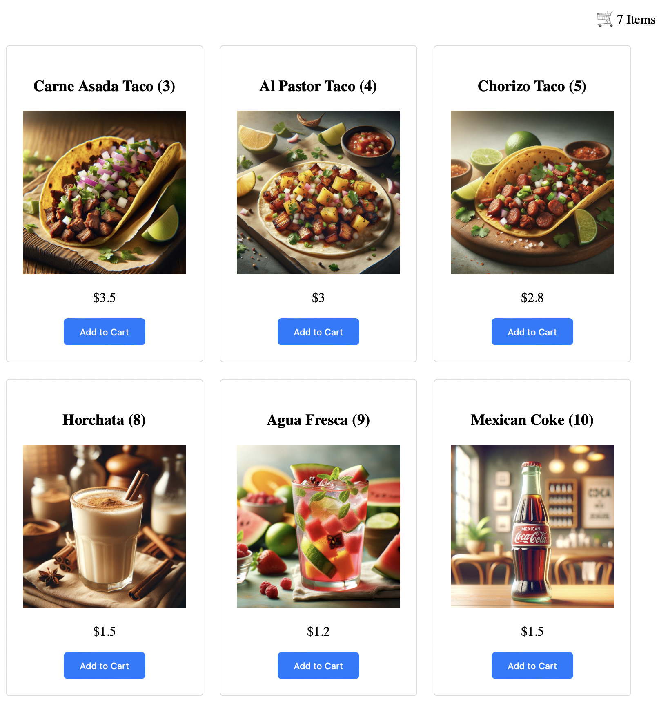

# TuringTaqueriaApi-FastApi-Backend

## Overview
Welcome to the "TuringTaqueriaApi-FastApi-Backend" repository! This application is developed as a companion to the series of articles in "The Turing Taco Tales". You can find insightful articles and discussions [here](https://www.turingtaco.com).

## Purpose
This project serves as a practical companion for the end-to-end implementation of the "Ensuring Quality Releases" project. It aims to provide a hands-on experience and enhance the learning journey for readers and followers of "The Turing Taco Tales".

## Application Structure
This application is meant as a companion application for Udacity's Ensuring Quality Releases. The goal is to provide the students with an application they can use to create an end to end Azure Pipeline allowing them to use the same application to deploy as an Azure App and run validation and UI and performance tests against them.

The application is built using the FastAPI framework, it has a backend and frontend components. The backend provides a Rest API that can be used for the Postman tests, and a frontend for the selenium tests.

### Login Page

### Product Page

## Getting Started
Detailed instructions on setting up and running the project will be provided soon.

## Contributions
We welcome contributions and suggestions to improve this application. Please feel free to submit issues and pull requests.

## License
This project is open source and available under BSD 3-Clause License.

Stay tuned for more updates and happy coding!
